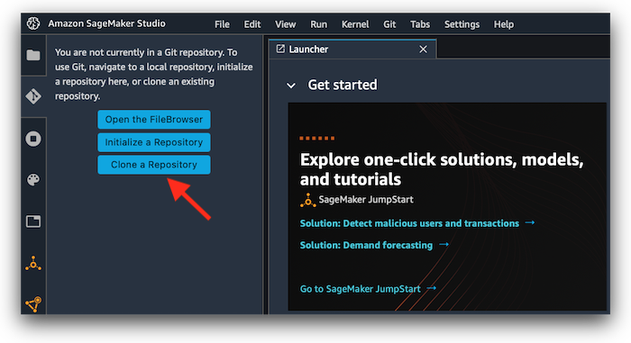
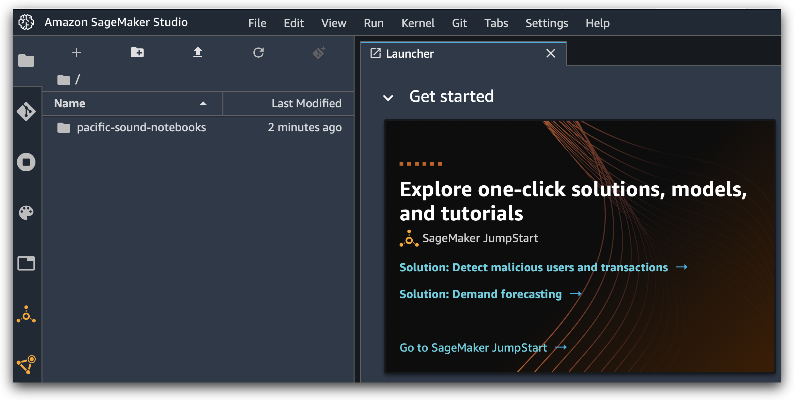
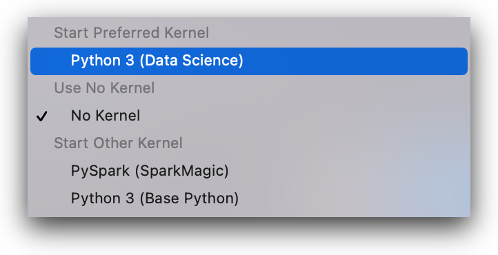
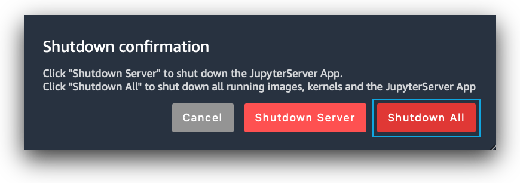

**SageMaker**  is a service in [AWS](https://aws.amazon.com) that can accelerate data analysis of the enormous volume of 
data freely available in the [pacific-sound](https://registry.opendata.aws/pacific-sound) registry using machine learning.
SageMaker allows for collaborative sharing of jupyter notebooks, easy ways to scale compute and storage resources for the 
problem at hand, and a seamless path to move from development to production. 

To use SageMaker:

  1. [Setup an Amazon cloud account if you don't already have one](https://docs.aws.amazon.com/sagemaker/latest/dg/gs-set-up.html). 
You will only be charged for the service you use.  Here is a [pricing calculator](https://aws.amazon.com/sagemaker/pricing/).
  2. If you are new to SageMaker, read [this.](https://docs.aws.amazon.com/sagemaker/latest/dg/whatis.html#first-time-user)
  3. [Follow these instructions to launch a SageMaker Studio session.](https://docs.aws.amazon.com/sagemaker/latest/dg/onboard-quick-start.html)
  4. Once you have your session open, this repository can be retrieved as follows:
 
Select the repository icon, then select "Clone a Repository"

Enter  https://github.com/mbari-org/pacific-sound-notebooks.git

You should see the repository folder pacific-sound after the notebooks are checked out

The recommended kernel to start with is the Data Science kernel. You can also change the kernel at any time in the notebook.

When you are done, it is recommended that you shut down everything, unless you have something that you need to run longer to avoid costs.

**Important** You will *not* lose your data until you remove the studio session altogether. It does not delete itself after
shutting down. The session can be launched again easily with your current code and data.  There is a cost 
associated with keeping the notebooks available for the elastic storage that stores the studio environments. The cost 
is nominal for storing the code; be cautious about how much data you store in your studio, as elastic storage
can be expensive for large collections.